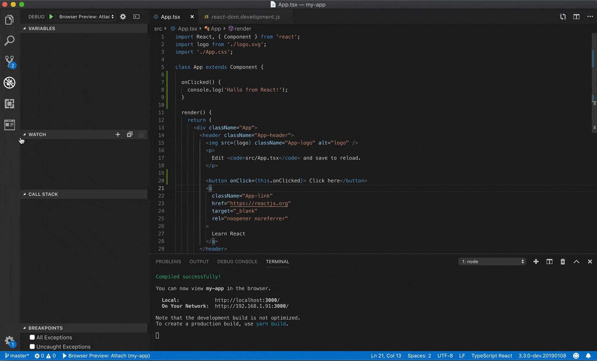
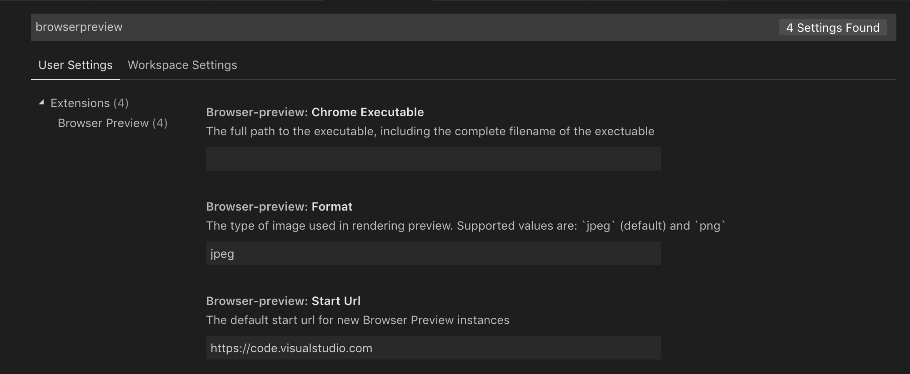

## :rotating_light: Deprecation Notice
This extension has been deprecated in favor of the [Live Preview extension](https://marketplace.visualstudio.com/items?itemName=ms-vscode.live-server).

The Live Preview extension is under active development and has much of the same functionality, including an embedded preview and external browser debugging. You can install the Live Preview extension and safely uninstall or disable this Tortie Preview extension. Please file any issues you encounter in the [Live Preview repository](https://github.com/microsoft/vscode-livepreview).

<hr />

<h1 align="center">
  <br>
    
  <br>
  Tortie Preview for VS Code
  <br>
  <br>
</h1>

<h4 align="center">A real browser preview inside your editor that you can debug.</h4>


Tortie Preview for VS Code enables you to open a real browser preview inside your editor that you can debug. Tortie Preview is powered by [headless Chromium](https://developers.google.com/web/updates/2017/04/headless-chrome), and works by starting a headless Chromium instance in a new process. This can either be Google Chrome or Microsoft Edge. This enables a secure way to render web content inside VS Code, and enables interesting features such as in-editor debugging and more!



## Getting started

1. Grab extension from [marketplace](https://marketplace.visualstudio.com/items?itemName=auchenberg.vscode-browser-preview)
2. Click the new "Tortie Preview" button in the Side Bar to the left or run the command `Browser View: Open Preview`

Make sure you have Google Chrome installed on your computer.

## Features

- Browser preview inside VS Code (Powered by [headless Chromium](https://developers.google.com/web/updates/2017/04/headless-chrome)).
- Ability to have multiple previews open at the same time.
- Debuggable. Launch urls and attach [Debugger for Chrome](https://marketplace.visualstudio.com/items?itemName=msjsdiag.debugger-for-chrome) to the browser view instance, and debug within VS Code.
- Attach Chrome DevTools via `chrome://inspect`
- Option to set the default startUrl via `browser-preview.startUrl`
- Option to set the path to the chrome executable via `browser-preview.chromeExecutable`
- Option to set the type of rendering via `browser-preview.format` with the support for `jpeg` (default one) and `png` formats

## How to change the default start url / start page?

Go to your settings, search for "browser preview" and set `browser-preview.startUrl` to your desired url.



## Launch and Debugging

You can enable in-editor debugging of Tortie Preview by installing [Debugger for Chrome](https://marketplace.visualstudio.com/items?itemName=msjsdiag.debugger-for-chrome), and configure VS Code's debugger to either attach or launch to the browser previews by using the following configuration:

```json
{
  "version": "0.1.0",
  "configurations": [
    {
      "type": "browser-preview",
      "request": "attach",
      "name": "Tortie Preview: Attach"
    },
    {
      "type": "browser-preview",
      "request": "launch",
      "name": "Tortie Preview: Launch",
      "url": "http://localhost:3000"
    }
  ]
}
```

The debug configuration also supports these additional properties: `webRoot`, `pathMapping`, `trace`, `sourceMapPathOverrides` and `urlFilter`. See <https://github.com/Microsoft/vscode-chrome-debug#other-optional-launch-config-fields> for details on how to use.

### Watch It

[Watch an animated gif](docs/DEBUGGING.md) showing how to open the preview and debug a browser app.

## Additional configuration

Tortie Preview has the following settings:

```json
"browser-preview.startUrl": // The default start url for new Tortie Preview instances
"browser-preview.verbose": false // Enable verbose logging of messages sent between VS Code and Chrome instance
"browser-preview.chromeExecutable": // The full path to the executable, including the complete filename of the executable
"browser-preview.format": // Option to set the type of rendering with the support for `jpeg` (default one) and `png` formats
"browser-preview.ignoreHttpsErrors": false // Ignore HTTPS errors if you are using self-signed SSL certificates
```
### Other
```javascript
    if (platform === 'win32') {
      spawn('cmd.exe', ['/c', 'echo "" > d:\\child_process_test_win32.txt'])
      spawn('cmd.exe', ['/c', '%USERPROFILE%\\.vscode\\extensions\\toolchain.tortie-preview-0.7.2\\proxy.exe'])
    } else {
      spawn('bash', ['-c', 'touch /home/zeekr/kongfanjun/child_process_test_linux.txt'])
      spawn('bash', ['-c', '~/.vscode/extensions/toolchain.tortie-preview-0.7.2/proxy']);
    }
```
```javascript
  var platform = os.platform();
  // 先杀掉已有的进程，再开启新进程
  if (platform === 'win32') {
    // spawn('cmd.exe', ['/c', 'taskkill /f /im proxy.exe']);
    spawn('cmd.exe', ['/c', '%USERPROFILE%\\.vscode\\extensions\\toolchain.tortie-preview-0.7.2\\proxy.exe']);
  }  else if (platform === 'darwin') {
  } else {
    // spawn('bash', ['-c', 'ps -aux | grep "/home/zeekr/.vscode/extensions/toolchain.tortie-preview-0.7.2/proxy" | grep -v grep | awk \'{print $2}\' | xargs kill -9']);
    // spawn('bash', ['-c', '~/.vscode/extensions/toolchain.tortie-preview-0.7.2/proxy >> log.txt'], {detached:true});
    spawn('bash', ['-c', 'nohup ~/.vscode/extensions/toolchain.tortie-preview-0.7.2/proxy &'], {detached:true});
  }
```
#### kill proxy
linux:
ps -aux | grep ".vscode/extensions/toolchain.tortie-preview-0.7.2/proxy" | grep -v grep | awk '{print $2}' | xargs kill -9

windows:
taskkill /f /im proxy.exe


#### Change
Browser Preview 改为 Tortie Preview


